# 🚀 Airflow Training Plan - Progressive Learning Path

## 📚 **Training Overview**
This training plan takes you from Airflow basics to advanced concepts through hands-on DAG examples. Each step builds upon the previous one.

---

## 🎯 **Step 1: Hello World DAG** ✅ **COMPLETED**
**File:** `dags/01_hello_world_dag.py`

### **What You Learned:**
- Basic DAG structure and configuration
- PythonOperator and BashOperator
- Linear task dependencies (`>>`)
- Logging and return values
- Schedule configuration

### **Key Concepts:**
- DAG definition with `default_args`
- Task creation and linking
- Simple scheduling with `timedelta`

---

## 🔀 **Step 2: Branching & Conditional Logic**
**File:** `dags/02_branching_dag.py`

### **What You'll Learn:**
- BranchPythonOperator for conditional flows
- Multiple execution paths
- DummyOperator for flow control
- Task skipping and conditional execution

### **Key Concepts:**
- Dynamic task selection based on conditions
- Branch joins and task convergence
- Airflow's handling of skipped tasks

---

## 📨 **Step 3: Data Exchange & Communication**
**File:** `dags/03_xcom_data_dag.py`

### **What You'll Learn:**
- XCom (Cross-Communication) for data passing
- Task return values and data sharing
- Template variables and Jinja2
- Task context and metadata access

### **Key Concepts:**
- Pushing and pulling data between tasks
- Task templating and dynamic values
- Context variables and execution metadata

---

## 📡 **Step 4: External Systems & Sensors**
**File:** `dags/04_sensors_dag.py`

### **What You'll Learn:**
- FileSensor for waiting on external files
- S3KeySensor for cloud storage monitoring
- Custom sensors and polling patterns
- Timeout handling and sensor modes

### **Key Concepts:**
- Reactive workflows triggered by external events
- Polling vs. event-driven patterns
- Sensor configuration and optimization

---

## 🔄 **Step 5: Dynamic Task Generation**
**File:** `dags/05_dynamic_tasks_dag.py`

### **What You'll Learn:**
- Dynamic task creation with loops
- Task mapping and parallel processing
- Variable number of tasks based on data
- Dynamic DAG generation patterns

### **Key Concepts:**
- Creating tasks programmatically
- Parallel processing and task groups
- Data-driven workflow generation

---

## 🛠️ **Step 6: Error Handling & Resilience**
**File:** `dags/06_error_handling_dag.py`

### **What You'll Learn:**
- Retry strategies and backoff policies
- Failure callbacks and notifications
- Task dependencies with failure handling
- SLA monitoring and alerting

### **Key Concepts:**
- Building robust, production-ready workflows
- Error recovery and notification patterns
- Monitoring and observability

---

## ⏰ **Step 7: Advanced Scheduling & Triggers**
**File:** `dags/07_advanced_scheduling_dag.py`

### **What You'll Learn:**
- Custom timetables and complex schedules
- Manual triggers and external APIs
- Backfill strategies and data corrections
- Asset-based triggering (Airflow 3.0)

### **Key Concepts:**
- Production scheduling patterns
- Data pipeline orchestration
- Integration with external systems

---

## 🎓 **Learning Progression**

```mermaid
flowchart TD
    A["🏁 Step 1: Hello World<br/>Linear Dependencies"] --> B["🔀 Step 2: Branching<br/>Conditional Logic"]
    B --> C["📨 Step 3: Data Exchange<br/>XComs & Templates"]
    C --> D["📡 Step 4: External Systems<br/>Sensors & Triggers"]
    D --> E["🔄 Step 5: Dynamic Tasks<br/>Programmatic Generation"]
    E --> F["🛠️ Step 6: Error Handling<br/>Robust Workflows"]
    F --> G["⏰ Step 7: Advanced Scheduling<br/>Production Patterns"]
    G --> H["🎯 Production Ready!"]
```

---

## 📋 **Prerequisites for Each Step**
- **Step 1:** Basic Python knowledge
- **Step 2:** Understanding of conditional logic
- **Step 3:** JSON/data structure concepts
- **Step 4:** File systems and external APIs
- **Step 5:** Programming loops and data processing
- **Step 6:** Error handling patterns
- **Step 7:** Production system concepts

---

## 🚀 **Getting Started**

1. **Complete each step in order** - Each builds on the previous
2. **Run each DAG** - Trigger manually to see the concepts in action
3. **Examine the logs** - Understanding task execution is crucial
4. **Modify and experiment** - Change parameters and see the effects
5. **Check the Web UI** - Use the graph view to visualize workflows

---

## 📝 **Next Steps After Training**

After completing this training, you'll be ready to:
- Build production Airflow workflows
- Integrate with external systems
- Handle errors and monitoring
- Design scalable data pipelines
- Implement complex scheduling patterns

Let's start with **Step 1: Branching & Conditional Logic**! 🔀
